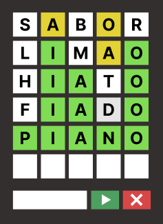
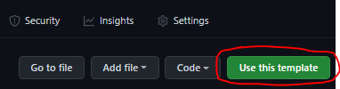
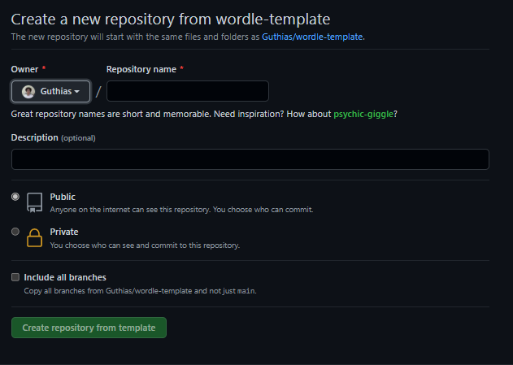

# O que vamos desenvolver
Nesse projeto vamos desenvolver um jogo de adivinhar palavras inspirado no  [Wordle](https://www.nytimes.com/games/wordle/index.html) sinta-se livre para desenvolver da forma que preferir, use e abuse da sua criatividade 😄

# Como o jogo funciona?
O objetivo é adivinhar uma palavra aleatória de 5 letras, após uma tentativa você recebe dicas sobre as letras

- Amarelo: A letra existe mas está no lugar incorreto
- Verde: A letra existe e está no lugar correto

Com essas dicas o jogador precisa deduzir a palavra correta em menos de 6 tentativas
 

 
## Inspirações
Caso você queira entender na pratica como o jogo funciona dê uma olhadinha nos links abaixo

- [Wordle](https://www.nytimes.com/games/wordle/index.html) (Versão original em inglês)
- [Letreco](https://www.gabtoschi.com/letreco/) (Versão em português)
- [term.ooo](https://term.ooo/) (Versão em português com opções de jogar com 1, 2 ou 4 palavras)

# Como iniciar o projeto
- Vá até o repositório [wordle-template](https://github.com/Guthias/wordle-template)
- Clique em **Use this template**

- Escreva o nome do seu projeto
- Clique em **Create a repository from this template**

- Copie a chave SSH e comece a desenvolver 🥰

# Requisitos
Para poder participar da votação, o seu código **OBRIGATORIAMENTE** precisa atender os pontos abaixo

Sua aplicação precisa conter as funcionalidades abaixo e elas precisam ser testadas
- [ ] As dicas são mostradas corretamente
- [ ] Deve ser possível escrever uma palavra
- [ ] Deve ter o comportamento esperado caso o Player ganhe
- [ ] Deve ter o comportamento esperado caso o Player perca

Além disso você precisa
- [ ] Fazer o deploy
- [ ] Preencher o [formulário de participação](https://forms.gle/cHdk8nTbHBPcNpBz7)

# Sugestão de como desenvolver
As sugestões abaixo são apenas um guia para poder facilitar o desenvolvimento, mas sinta-se **TOTALMENTE LIVRE** para fazer da forma que preferir desde que os requisitos estejam sendo atendidos

## 1 - Criar um Input de texto para o usuário enviar a palavra

### Oque é esperado

- Deve conter um input
- A Palavra deve ser armazenada no estado

## 2 - Construa uma tabela com 6 linhas (Quantidade de tentativas) e 5 colunas (Quantidade de letras)

### O que é esperado

- Ter um quadro com 6 linhas`<tr>` (Quantidade de tentativas)
- Ter um quadro com 5 colunas `<td>` (Quantidade de letras)

## 3 - Criar um botão para enviar o Input

### Oque é esperado

- O botão está desabilitado quando a palavra contem menos ou mais de 5 letras
- Ao clicar a palavra ser mostrada na linha da tabela (Uma letra em cada célula)

## 4 - Criar um botão para limpar o Input

### Oque é esperado
- O input é limpo após clicar no botão

## 5 - Pegar uma palavra _randômica_ do arquivo `data/wordlist.js` para ser a palavra chave

### O que é esperado
- Quando a aplicação carregue, uma palavra _randômica_
- Guardar a palavra selecionada em um gerenciador de Estado (Redux ou Context)

## 6 - Implementar a logica de verificação

### Oque é esperado
- Armazenar oque o usuário digitou
- Verificar a posição das letras
	- Amarelo: letra existente no lugar errado
	- Verde: letra existente no lugar certo
- Mostra um aviso caso a palavra não exista no banco de palavras (`data/wordlist.js`)

## 7 - Implementa a logica de verificação da palavra chave
### Oque é esperado
 - Se o usuário acertar
	- Verifica-se é redirecionado para a tela de feedback
- Se o usuário errar
	- Ir para a próxima linha
- Se o usuário errar e não tiver mais tentativas
	- Redirecionar para a tela de feedback

## 8 - Feedbacks

- Deve mostrar uma mensagem de acordo com o numero de tentativas

### Exemplo:
| Tentativas            | Resultado     |
|-----------------------|---------------|
| Menos de 3 tentativas | Excelente     |
| > 3 e > 5 tentativas  | Muito bom     |
| 6 tentativas          | Foi por pouco |
| Não tiver acertado    | Você perdeu   |
